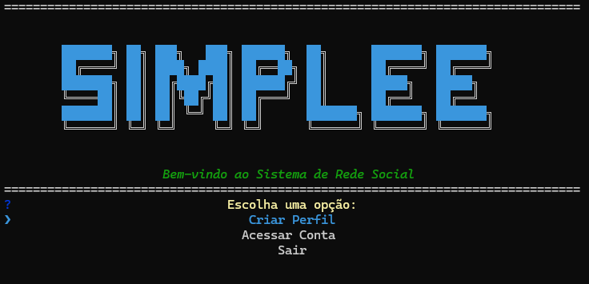
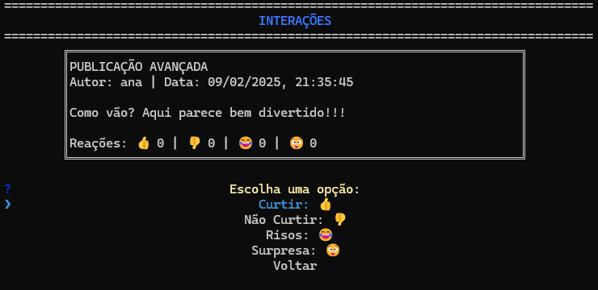

# Social Network Project

## ✨ Bem-vindo!

Bem-vindo ao **Social Network Project** – sua rede social interativa construída com TypeScript e Node.js. Explore publicações, interaja com perfis e divirta-se com funcionalidades dinâmicas e menus interativos!

## 📖 Sobre o Projeto

- **Interface Interativa:** Menus dinâmicos e prompts que guiam sua experiência.
- **Funcionalidades Dinâmicas:** Cadastro, login, publicações simples e avançadas com interações via emojis.
- **Design Visual Agradável:** Boxes estilizadas e feedback visual para uma experiência imersiva.

## 🚀 Começando

### Pré-requisitos
- [Node.js](https://nodejs.org) instalado.
- [Git](https://git-scm.com) para clonar o repositório.

### Instalação
1. Clone o repositório:
   ```bash
   git clone https://github.com/seu-usuario/social-network-project.git
   ```
2. Acesse a pasta do projeto:
   ```bash
   cd social-network-project
   ```
3. Instale as dependências:
   ```bash
   npm install
   ```
4. Inicie a aplicação:
   ```bash
   npm start
   ```

## 📸 Simplee em Ação

Confira algumas imagens do Simplee:




## 👥 Contribuidores

Agradecemos a todos que contribuíram para este projeto:
- [Álvaro Pietro](https://github.com/PietroDev-01)
- [João Paulo Lopes](https://github.com/jpaullopes)
- [Thalyson Delano](https://github.com/thalyssonDEV)


## ▶️ Vídeo Explicativo

Assista ao vídeo no YouTube para conhecer mais sobre o projeto e seu funcionamento:
[Assista ao vídeo](https://www.youtube.com/link-do-video)

## 🔍 Exploração Interativa

- **Navegação Dinâmica:** Utilize menus e prompts para explorar publicações, gerenciar perfis e interagir com amigos.
- **Experiência Personalizada:** Alterne entre modos simples e avançados para descobrir diversas interações.
- **Feedback Visual:** Mensagens coloridas e boxes estilizadas facilitam o uso e tornam a experiência única.

## 🛠️ Funcionalidades

- **Cadastro e Login:** Crie sua conta e acesse funcionalidades exclusivas.
- **Publicações:** Faça publicações simples ou avançadas, complementadas por interações com emojis.
- **Amizades:** Adicione, remova e visualize perfis de amigos com detalhes.
- **Interações:** Dê curtidas, reaja e interaja de forma intuitiva.

## 📚 Tecnologias Utilizadas

- **TypeScript** para desenvolvimento robusto.
- **Node.js** para execução do backend.
- **Inquirer** para uma interface interativa via terminal.
- **JSON** para armazenamento local de dados.

## 📜 Licença

Distribuído sob a licença MIT. Veja o arquivo [`LICENSE`](./LICENSE) para mais detalhes.

## 💡 Dicas e Truques

- Explore os menus interativos para uma experiência mais rica.
- Leia os comentários no código fonte para entender melhor as funcionalidades.
- Aproveite a interface visual e a resposta dinâmica do aplicativo.

---

Divirta-se e aproveite sua jornada no **Simplee**!
